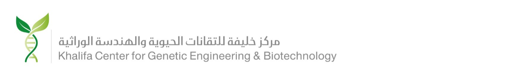

# Coding the Genome (CG)
## Genomics and Bioinformatics Course

A dual English and Arabic language course to train the next generation of bioinformatics scientists.

Created and delivered by **Dr.** [Talal Al-Yazeedi](https://github.com/alyazeeditalal) under the supervision of **Professor** [Khalid Amiri](https://research.uaeu.ac.ae/en/persons/khaled-amiri/).

## Current Host Institute

<div style="text-align: center; padding: 2rem 0;">

  

  <br>

  
</div>

---

Welcome to Coding the Genome (CG), a bioinformatics course designed to provide you with the foundational knowledge and practical skills needed to work with large-scale genomic data.

```{note}
This course is actively being developed. New sessions will be added regularly.
```

## Sessions

```{toctree}
:maxdepth: 2
:caption: Contents

preface
sessions/01_bioinformatics_file_types
sessions/02_linux_essentials
sessions/03_database_navigation
sessions/04_project_organisation
```

---

**Ready to start?** Head to the [Preface](preface.md) to learn more about this course.
